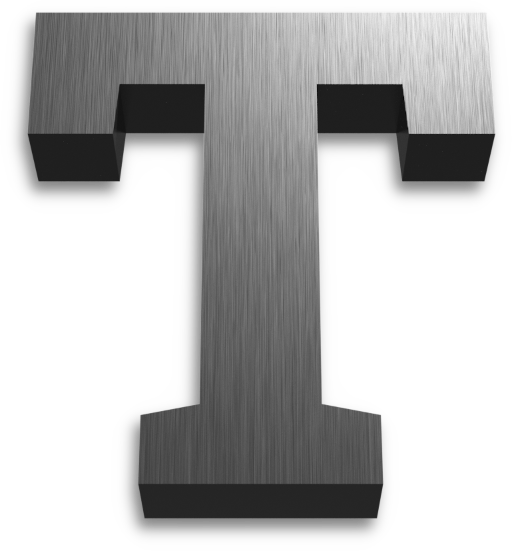
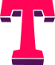

    

# Thallium Graphics Library

The Thallium Project is a library for C/C++ applications that will provide the ability to write cross-renderer applications with the same interface.
Cross-platform APIs (i.e. Vulkan and OpenGL) will be prioritised, but I plan to also implement dumber APIs such as Metal, DX11, and DX12 in the
far future.

> **Warning**: I am a student and Thallium is a very work-in-progress **personal project**, so updates can be erratic and broken for others. Over
> time, I aim to make the library more useful to others.

As a side-note, I track TO-DO items on [Trello](https://trello.com/b/Fbj9GSzf/thallium-todo) and occassionally with GitHub issues in this repository.

See [this file](SPECIFICATION.md) for the working Specification.

## Project logos

Thallium has two project logos. The rendered one is used more often as the actual de facto icon of the project, whilst the vector one is used for
smaller applications, like on the documentation.

|                               Render                               |                                Vector                               |
| ------------------------------------------------------------------ | ------------------------------------------------------------------- |
|  

 |  

 |

The colour theme used by the project (which is reflected in the vector logo) consists of neon pink (`#ff0457`) and dark purple (`#521057`).
