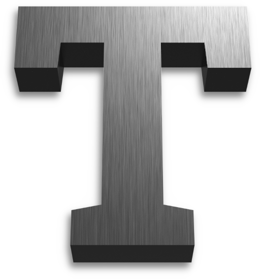

    

# Thallium Graphics Library

The Thallium Project is a library for C/C++ applications that will provide the ability to write cross-renderer applications with the same interface.
Cross-platform APIs (i.e. Vulkan and OpenGL) will be prioritised, but I plan to also implement dumber APIs such as Metal, DX11, and DX12 in the
far future.

> **Warning**: I am a student and Thallium is a very work-in-progress **personal project**, so updates can be erratic and broken for others. Over
> time, I aim to make the library more useful to others.

As a side-note, I track TO-DO items on [Trello](https://trello.com/b/ZHYGTiZr/thallium-development-tracking). GitHub issues on this repository are
also used to track bugs or requests.

## Documentation

For the Thallium API documentation, see the GitHub Pages instance at https://kosude.github.io/thallium/.

Local HTML documentation can be generated at compilation with the `-DTHALLIUM_BUILD_DOCS=ON` flag, as above. This is not default behaviour and is not
recommended, as it can lengthen build time, and requires Doxygen to be installed as well as several Python modules (listed in the
[docs/requirements.txt](docs/requirements.txt) file for pip).

## Building

CMake is used to generate build files. Ideally, you should build in a Linux environment - do note however that MinGW32 and subsystems like Cygwin
and MSYS2 have not yet been tested.

### General options

The following is a table of available CMake configuration options for Thallium. Note that this list may be missing some, so check the appropriate
`CMakeLists.txt` file to make sure.

|        Option name      |            Description           | Default |
| ----------------------- | -------------------------------- | ------- |
| BUILD_SHARED_LIBS       | Build shared libraries           | ON      |
| THALLIUM_BUILD_LIB      | Build the Thallium library       | ON      |
| THALLIUM_BUILD_TESTS    | Build Thallium tests             | OFF     |
| THALLIUM_BUILD_EXAMPLES | Build Thallium example projects  | OFF     |
| THALLIUM_BUILD_DOCS     | Build HTML documentation         | OFF     |

### API modules

Thallium source compilation is split into **modules**, based on the graphics APIs you need support for. Each module can be manually enabled or
disabled with CMake flags, just like above. These flags are named `THALLIUM_BUILD_MODULE_<API>`. For example, the Vulkan module can be compiled using
the `-DTHALLIUM_BUILD_MODULE_VULKAN=ON` build flag (this requires the Vulkan SDK to be installed).

### WSI flags

Window system integration (WSI) is available depending on the target platform:

 - On Apple systems, `THALLIUM_WSI_COCOA` is available and enabled by default.
 - On other \*nix systems, `THALLIUM_WSI_XCB` and `THALLIUM_WSI_XLIB` are both available and enabled by default. *Wayland is not yet supported.*

## Information for contributing

Document **all** new public functions or types with [Doxygen](https://www.doxygen.nl/)-style formatting. Also see the
[Breathe documentation](https://breathe.readthedocs.io/en/latest/index.html) to find out how to include your code's documentation in the HTML
output.
