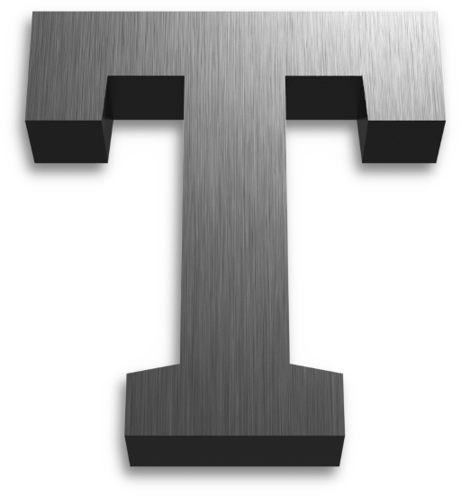
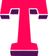

    

# Thallium Graphics Library

Thallium is a C/C++ library that will provide the ability to write cross-renderer applications with the same interface. Cross-platform
renderers (i.e. Vulkan and OpenGL) will be prioritised, but I plan to also implement Metal, DX11, and DX12 in the far future.

> **Warning**: Thallium is a very work-in-progress **personal project**, so it can change at any time, and without warning.
> Please see the [Trello board](https://trello.com/b/Fbj9GSzf/thallium-todo) for a TO-DO list.

## Building

CMake is used to generate build files. *This section assumes you are building on a Linux machine.*

The available command-line options can be seen below. Alternatively, you can use the `utils/build.sh` interactive script to build the
project, if that's what you prefer.

### General options

|        Option name      |            Description           | Default |
| ----------------------- | -------------------------------- | ------- |
| BUILD_SHARED_LIBS       | Build shared libraries           | ON      |
| THALLIUM_BUILD_LIB      | Build core library               | ON      |
| THALLIUM_BUILD_DOCS     | Build HTML documentation         | OFF     |
| THALLIUM_DEBUG_LAYER    | Enable the Thallium debug layer  | ON      |
| THALLIUM_SKIP_VERSION   | Skip getting VCS project version | OFF     |

> **Note**: By default, a detailed project version is fetched dynamically (via a Python script) with information from Git.
> This can be disabled by setting THALLIUM_SKIP_VERSION to ON. If it is not disabled, you need to have the
> [GitPython](https://github.com/gitpython-developers/GitPython) package installed. **This cannot be disabled if documentation
> is being built.** *(i.e. THALLIUM_SKIP_VERSION and THALLIUM_BUILD_DOCS are mutually exclusive.)*

### When building core library

These options are only available if THALLIUM_BUILD_LIB is ON.

|          Option name         |           Description         | Default |
| ---------------------------- | ----------------------------- | ------- |
| THALLIUM_BUILD_MODULE_VULKAN | Build Vulkan library module   | OFF     |
| THALLIUM_BUILD_TESTS         | Build test executables        | OFF     |
| THALLIUM_BUILD_EXAMPLES      | Build example projects        | OFF     |

## Documentation

Please see the Thallium documentation hosted on GH Pages at https://kosude.github.io/thallium/. Local HTML documentation can also be built by setting
`-DTHALLIUM_BUILD_DOCS=ON`, when compiling.

## Project logos

Thallium has two project logos. The rendered one is used more often as the actual de facto icon of the project, whilst the vector one is used for
smaller applications, like on the documentation.

|                               Render                               |                                Vector                               |
| ------------------------------------------------------------------ | ------------------------------------------------------------------- |
|  

 |  

 |

The colour theme used by the project (which is reflected in the vector logo) consists of neon pink (`#ff0457`) and dark purple (`#521057`).
